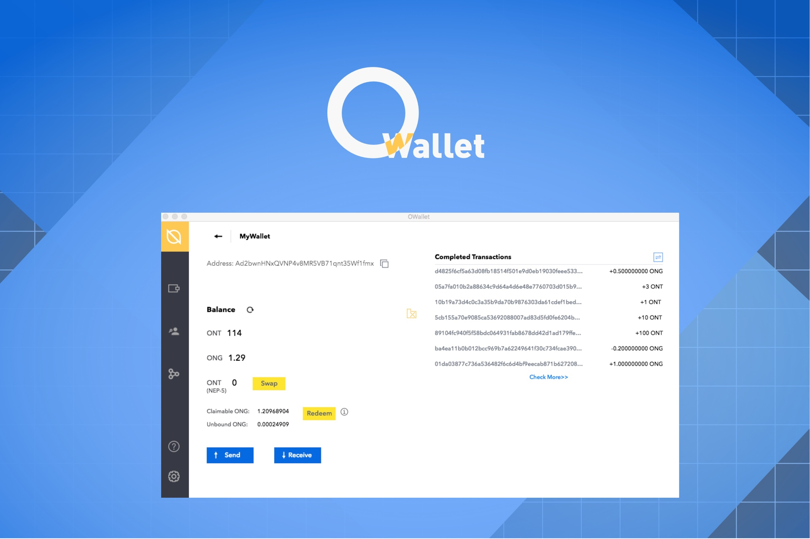

[中文版](./README_cn.md)


<h1 align="center">OWallet - a comprehensive Ontology desktop wallet</h1>
<h4 align="center">Version 0.9.25</h4>

## Introduction

OWallet is a comprehensive Ontology desktop wallet. OWallet supports standard wallet management, shared wallet management based on multi-signature technology, and will also connect with various hard wallets such as Ledger, Trezor, and so on. In the next phase, OWallet will integrate more applications, providing developers with smart contract compilation, invocation, and other comprehensive services.

Support Windows/MacOS/Linux,get it [Here](https://github.com/ontio/OWallet/releases)，also welcome to join [our community on Discord](https://discord.gg/4TQujHj).

Core features of OWallet are as follows:

* Create wallet/import wallet using keystore,mnemonic phrase,WIF private key,HEX private key
* Support shared wallet based on multi-signature technology
* Ledger support
* View balance and record
* Send ONG and ONT
* Withdraw (redeem) ONG
* Node stake and stake authorization management
* ONT ID support
* Integrate gateway provided by changelly and cryptonex




## Get started

1. Clone the repo

```
git clone https://github.com/ontio/OWallet.git
```

2. Install packages
**yarn** is recommended.
```
yarn
```

3. Run in Development

```
yarn serve
```

4. Build

```
yarn build
```

## Install released app

Please download the latest version that is compatiable with your platform.

## Default keystore.db file path

Default points to:

* %APPDATA% on `Windows`

* $XDG_CONFIG_HOME or ~/.config on `Linux`

* ~/Library/Application Support on `macOS`
